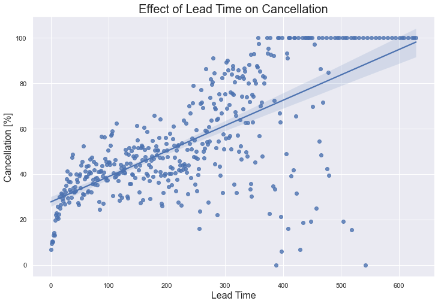

```python
import pandas as pd
import numpy as np                #Python Program to create a data type object
import seaborn as sns             #visualisation
import matplotlib.pyplot as plt   #visualisation
%matplotlib inline
sns.set(color_codes = True)       #default colours are used

df = pd.read_csv(r"/Users/tiaranazri/Downloads/hotel_bookings.csv")
df
```


<div>
<style scoped>
    .dataframe tbody tr th:only-of-type {
        vertical-align: middle;
    }

    .dataframe tbody tr th {
        vertical-align: top;
    }

    .dataframe thead th {
        text-align: right;
    }
</style>
<table border="1" class="dataframe">
  <thead>
    <tr style="text-align: right;">
      <th></th>
      <th>hotel</th>
      <th>is_canceled</th>
      <th>lead_time</th>
      <th>arrival_date_year</th>
      <th>arrival_date_month</th>
      <th>arrival_date_week_number</th>
      <th>arrival_date_day_of_month</th>
      <th>stays_in_weekend_nights</th>
      <th>stays_in_week_nights</th>
      <th>adults</th>
      <th>...</th>
      <th>deposit_type</th>
      <th>agent</th>
      <th>company</th>
      <th>days_in_waiting_list</th>
      <th>customer_type</th>
      <th>adr</th>
      <th>required_car_parking_spaces</th>
      <th>total_of_special_requests</th>
      <th>reservation_status</th>
      <th>reservation_status_date</th>
    </tr>
  </thead>
  <tbody>
    <tr>
      <th>0</th>
      <td>Resort Hotel</td>
      <td>0</td>
      <td>342</td>
      <td>2015</td>
      <td>July</td>
      <td>27</td>
      <td>1</td>
      <td>0</td>
      <td>0</td>
      <td>2</td>
      <td>...</td>
      <td>No Deposit</td>
      <td>NaN</td>
      <td>NaN</td>
      <td>0</td>
      <td>Transient</td>
      <td>0.00</td>
      <td>0</td>
      <td>0</td>
      <td>Check-Out</td>
      <td>01/07/2015</td>
    </tr>
    <tr>
      <th>1</th>
      <td>Resort Hotel</td>
      <td>0</td>
      <td>737</td>
      <td>2015</td>
      <td>July</td>
      <td>27</td>
      <td>1</td>
      <td>0</td>
      <td>0</td>
      <td>2</td>
      <td>...</td>
      <td>No Deposit</td>
      <td>NaN</td>
      <td>NaN</td>
      <td>0</td>
      <td>Transient</td>
      <td>0.00</td>
      <td>0</td>
      <td>0</td>
      <td>Check-Out</td>
      <td>01/07/2015</td>
    </tr>
    <tr>
      <th>2</th>
      <td>Resort Hotel</td>
      <td>0</td>
      <td>7</td>
      <td>2015</td>
      <td>July</td>
      <td>27</td>
      <td>1</td>
      <td>0</td>
      <td>1</td>
      <td>1</td>
      <td>...</td>
      <td>No Deposit</td>
      <td>NaN</td>
      <td>NaN</td>
      <td>0</td>
      <td>Transient</td>
      <td>75.00</td>
      <td>0</td>
      <td>0</td>
      <td>Check-Out</td>
      <td>02/07/2015</td>
    </tr>
    <tr>
      <th>3</th>
      <td>Resort Hotel</td>
      <td>0</td>
      <td>13</td>
      <td>2015</td>
      <td>July</td>
      <td>27</td>
      <td>1</td>
      <td>0</td>
      <td>1</td>
      <td>1</td>
      <td>...</td>
      <td>No Deposit</td>
      <td>304.0</td>
      <td>NaN</td>
      <td>0</td>
      <td>Transient</td>
      <td>75.00</td>
      <td>0</td>
      <td>0</td>
      <td>Check-Out</td>
      <td>02/07/2015</td>
    </tr>
    <tr>
      <th>4</th>
      <td>Resort Hotel</td>
      <td>0</td>
      <td>14</td>
      <td>2015</td>
      <td>July</td>
      <td>27</td>
      <td>1</td>
      <td>0</td>
      <td>2</td>
      <td>2</td>
      <td>...</td>
      <td>No Deposit</td>
      <td>240.0</td>
      <td>NaN</td>
      <td>0</td>
      <td>Transient</td>
      <td>98.00</td>
      <td>0</td>
      <td>1</td>
      <td>Check-Out</td>
      <td>03/07/2015</td>
    </tr>
    <tr>
      <th>...</th>
      <td>...</td>
      <td>...</td>
      <td>...</td>
      <td>...</td>
      <td>...</td>
      <td>...</td>
      <td>...</td>
      <td>...</td>
      <td>...</td>
      <td>...</td>
      <td>...</td>
      <td>...</td>
      <td>...</td>
      <td>...</td>
      <td>...</td>
      <td>...</td>
      <td>...</td>
      <td>...</td>
      <td>...</td>
      <td>...</td>
      <td>...</td>
    </tr>
    <tr>
      <th>119385</th>
      <td>City Hotel</td>
      <td>0</td>
      <td>23</td>
      <td>2017</td>
      <td>August</td>
      <td>35</td>
      <td>30</td>
      <td>2</td>
      <td>5</td>
      <td>2</td>
      <td>...</td>
      <td>No Deposit</td>
      <td>394.0</td>
      <td>NaN</td>
      <td>0</td>
      <td>Transient</td>
      <td>96.14</td>
      <td>0</td>
      <td>0</td>
      <td>Check-Out</td>
      <td>06/09/2017</td>
    </tr>
    <tr>
      <th>119386</th>
      <td>City Hotel</td>
      <td>0</td>
      <td>102</td>
      <td>2017</td>
      <td>August</td>
      <td>35</td>
      <td>31</td>
      <td>2</td>
      <td>5</td>
      <td>3</td>
      <td>...</td>
      <td>No Deposit</td>
      <td>9.0</td>
      <td>NaN</td>
      <td>0</td>
      <td>Transient</td>
      <td>225.43</td>
      <td>0</td>
      <td>2</td>
      <td>Check-Out</td>
      <td>07/09/2017</td>
    </tr>
    <tr>
      <th>119387</th>
      <td>City Hotel</td>
      <td>0</td>
      <td>34</td>
      <td>2017</td>
      <td>August</td>
      <td>35</td>
      <td>31</td>
      <td>2</td>
      <td>5</td>
      <td>2</td>
      <td>...</td>
      <td>No Deposit</td>
      <td>9.0</td>
      <td>NaN</td>
      <td>0</td>
      <td>Transient</td>
      <td>157.71</td>
      <td>0</td>
      <td>4</td>
      <td>Check-Out</td>
      <td>07/09/2017</td>
    </tr>
    <tr>
      <th>119388</th>
      <td>City Hotel</td>
      <td>0</td>
      <td>109</td>
      <td>2017</td>
      <td>August</td>
      <td>35</td>
      <td>31</td>
      <td>2</td>
      <td>5</td>
      <td>2</td>
      <td>...</td>
      <td>No Deposit</td>
      <td>89.0</td>
      <td>NaN</td>
      <td>0</td>
      <td>Transient</td>
      <td>104.40</td>
      <td>0</td>
      <td>0</td>
      <td>Check-Out</td>
      <td>07/09/2017</td>
    </tr>
    <tr>
      <th>119389</th>
      <td>City Hotel</td>
      <td>0</td>
      <td>205</td>
      <td>2017</td>
      <td>August</td>
      <td>35</td>
      <td>29</td>
      <td>2</td>
      <td>7</td>
      <td>2</td>
      <td>...</td>
      <td>No Deposit</td>
      <td>9.0</td>
      <td>NaN</td>
      <td>0</td>
      <td>Transient</td>
      <td>151.20</td>
      <td>0</td>
      <td>2</td>
      <td>Check-Out</td>
      <td>07/09/2017</td>
    </tr>
  </tbody>
</table>
<p>119390 rows × 32 columns</p>
</div>


```python
df.shape
```


    (119390, 32)


```python
list(df.columns)
```


    ['hotel',
     'is_canceled',
     'lead_time',
     'arrival_date_year',
     'arrival_date_month',
     'arrival_date_week_number',
     'arrival_date_day_of_month',
     'stays_in_weekend_nights',
     'stays_in_week_nights',
     'adults',
     'children',
     'babies',
     'meal',
     'country',
     'market_segment',
     'distribution_channel',
     'is_repeated_guest',
     'previous_cancellations',
     'previous_bookings_not_canceled',
     'reserved_room_type',
     'assigned_room_type',
     'booking_changes',
     'deposit_type',
     'agent',
     'company',
     'days_in_waiting_list',
     'customer_type',
     'adr',
     'required_car_parking_spaces',
     'total_of_special_requests',
     'reservation_status',
     'reservation_status_date']


```python
fig, ax = plt.subplots(figsize = (10,6))
ax.hist(df['hotel'])
ax.set_xlabel('Hotel Type')
ax.set_ylabel('Booking Quantity')
plt.show()
```


    

    


```python
df.dtypes
```


    hotel                              object
    is_canceled                         int64
    lead_time                           int64
    arrival_date_year                   int64
    arrival_date_month                 object
    arrival_date_week_number            int64
    arrival_date_day_of_month           int64
    stays_in_weekend_nights             int64
    stays_in_week_nights                int64
    adults                              int64
    children                          float64
    babies                              int64
    meal                               object
    country                            object
    market_segment                     object
    distribution_channel               object
    is_repeated_guest                   int64
    previous_cancellations              int64
    previous_bookings_not_canceled      int64
    reserved_room_type                 object
    assigned_room_type                 object
    booking_changes                     int64
    deposit_type                       object
    agent                             float64
    company                           float64
    days_in_waiting_list                int64
    customer_type                      object
    adr                               float64
    required_car_parking_spaces         int64
    total_of_special_requests           int64
    reservation_status                 object
    reservation_status_date            object
    dtype: object


**DATA CLEANING**


```python
#rows containing duplicate data
duplicate_rows_df = df[df.duplicated()]
print('Number of Rows with Duplicated Data:', duplicate_rows_df.shape)
```

    Number of Rows with Duplicated Data: (31994, 32)


```python
df.count
```


    <bound method DataFrame.count of                hotel  is_canceled  lead_time  arrival_date_year  \
    0       Resort Hotel            0        342               2015   
    1       Resort Hotel            0        737               2015   
    2       Resort Hotel            0          7               2015   
    3       Resort Hotel            0         13               2015   
    4       Resort Hotel            0         14               2015   
    ...              ...          ...        ...                ...   
    119385    City Hotel            0         23               2017   
    119386    City Hotel            0        102               2017   
    119387    City Hotel            0         34               2017   
    119388    City Hotel            0        109               2017   
    119389    City Hotel            0        205               2017   
    
           arrival_date_month  arrival_date_week_number  \
    0                    July                        27   
    1                    July                        27   
    2                    July                        27   
    3                    July                        27   
    4                    July                        27   
    ...                   ...                       ...   
    119385             August                        35   
    119386             August                        35   
    119387             August                        35   
    119388             August                        35   
    119389             August                        35   
    
            arrival_date_day_of_month  stays_in_weekend_nights  \
    0                               1                        0   
    1                               1                        0   
    2                               1                        0   
    3                               1                        0   
    4                               1                        0   
    ...                           ...                      ...   
    119385                         30                        2   
    119386                         31                        2   
    119387                         31                        2   
    119388                         31                        2   
    119389                         29                        2   
    
            stays_in_week_nights  adults  ...  deposit_type  agent company  \
    0                          0       2  ...    No Deposit    NaN     NaN   
    1                          0       2  ...    No Deposit    NaN     NaN   
    2                          1       1  ...    No Deposit    NaN     NaN   
    3                          1       1  ...    No Deposit  304.0     NaN   
    4                          2       2  ...    No Deposit  240.0     NaN   
    ...                      ...     ...  ...           ...    ...     ...   
    119385                     5       2  ...    No Deposit  394.0     NaN   
    119386                     5       3  ...    No Deposit    9.0     NaN   
    119387                     5       2  ...    No Deposit    9.0     NaN   
    119388                     5       2  ...    No Deposit   89.0     NaN   
    119389                     7       2  ...    No Deposit    9.0     NaN   
    
           days_in_waiting_list customer_type     adr  \
    0                         0     Transient    0.00   
    1                         0     Transient    0.00   
    2                         0     Transient   75.00   
    3                         0     Transient   75.00   
    4                         0     Transient   98.00   
    ...                     ...           ...     ...   
    119385                    0     Transient   96.14   
    119386                    0     Transient  225.43   
    119387                    0     Transient  157.71   
    119388                    0     Transient  104.40   
    119389                    0     Transient  151.20   
    
            required_car_parking_spaces  total_of_special_requests  \
    0                                 0                          0   
    1                                 0                          0   
    2                                 0                          0   
    3                                 0                          0   
    4                                 0                          1   
    ...                             ...                        ...   
    119385                            0                          0   
    119386                            0                          2   
    119387                            0                          4   
    119388                            0                          0   
    119389                            0                          2   
    
            reservation_status reservation_status_date  
    0                Check-Out              01/07/2015  
    1                Check-Out              01/07/2015  
    2                Check-Out              02/07/2015  
    3                Check-Out              02/07/2015  
    4                Check-Out              03/07/2015  
    ...                    ...                     ...  
    119385           Check-Out              06/09/2017  
    119386           Check-Out              07/09/2017  
    119387           Check-Out              07/09/2017  
    119388           Check-Out              07/09/2017  
    119389           Check-Out              07/09/2017  
    
    [119390 rows x 32 columns]>


```python
#count the number of rows in each column
df.count()
```


    hotel                             119390
    is_canceled                       119390
    lead_time                         119390
    arrival_date_year                 119390
    arrival_date_month                119390
    arrival_date_week_number          119390
    arrival_date_day_of_month         119390
    stays_in_weekend_nights           119390
    stays_in_week_nights              119390
    adults                            119390
    children                          119386
    babies                            119390
    meal                              119390
    country                           118902
    market_segment                    119390
    distribution_channel              119390
    is_repeated_guest                 119390
    previous_cancellations            119390
    previous_bookings_not_canceled    119390
    reserved_room_type                119390
    assigned_room_type                119390
    booking_changes                   119390
    deposit_type                      119390
    agent                             103050
    company                             6797
    days_in_waiting_list              119390
    customer_type                     119390
    adr                               119390
    required_car_parking_spaces       119390
    total_of_special_requests         119390
    reservation_status                119390
    reservation_status_date           119390
    dtype: int64


```python
#drop the duplicate
df = df.drop_duplicates()
df.head(5)
```


<div>
<style scoped>
    .dataframe tbody tr th:only-of-type {
        vertical-align: middle;
    }

    .dataframe tbody tr th {
        vertical-align: top;
    }

    .dataframe thead th {
        text-align: right;
    }
</style>
<table border="1" class="dataframe">
  <thead>
    <tr style="text-align: right;">
      <th></th>
      <th>hotel</th>
      <th>is_canceled</th>
      <th>lead_time</th>
      <th>arrival_date_year</th>
      <th>arrival_date_month</th>
      <th>arrival_date_week_number</th>
      <th>arrival_date_day_of_month</th>
      <th>stays_in_weekend_nights</th>
      <th>stays_in_week_nights</th>
      <th>adults</th>
      <th>...</th>
      <th>deposit_type</th>
      <th>agent</th>
      <th>company</th>
      <th>days_in_waiting_list</th>
      <th>customer_type</th>
      <th>adr</th>
      <th>required_car_parking_spaces</th>
      <th>total_of_special_requests</th>
      <th>reservation_status</th>
      <th>reservation_status_date</th>
    </tr>
  </thead>
  <tbody>
    <tr>
      <th>0</th>
      <td>Resort Hotel</td>
      <td>0</td>
      <td>342</td>
      <td>2015</td>
      <td>July</td>
      <td>27</td>
      <td>1</td>
      <td>0</td>
      <td>0</td>
      <td>2</td>
      <td>...</td>
      <td>No Deposit</td>
      <td>NaN</td>
      <td>NaN</td>
      <td>0</td>
      <td>Transient</td>
      <td>0.0</td>
      <td>0</td>
      <td>0</td>
      <td>Check-Out</td>
      <td>01/07/2015</td>
    </tr>
    <tr>
      <th>1</th>
      <td>Resort Hotel</td>
      <td>0</td>
      <td>737</td>
      <td>2015</td>
      <td>July</td>
      <td>27</td>
      <td>1</td>
      <td>0</td>
      <td>0</td>
      <td>2</td>
      <td>...</td>
      <td>No Deposit</td>
      <td>NaN</td>
      <td>NaN</td>
      <td>0</td>
      <td>Transient</td>
      <td>0.0</td>
      <td>0</td>
      <td>0</td>
      <td>Check-Out</td>
      <td>01/07/2015</td>
    </tr>
    <tr>
      <th>2</th>
      <td>Resort Hotel</td>
      <td>0</td>
      <td>7</td>
      <td>2015</td>
      <td>July</td>
      <td>27</td>
      <td>1</td>
      <td>0</td>
      <td>1</td>
      <td>1</td>
      <td>...</td>
      <td>No Deposit</td>
      <td>NaN</td>
      <td>NaN</td>
      <td>0</td>
      <td>Transient</td>
      <td>75.0</td>
      <td>0</td>
      <td>0</td>
      <td>Check-Out</td>
      <td>02/07/2015</td>
    </tr>
    <tr>
      <th>3</th>
      <td>Resort Hotel</td>
      <td>0</td>
      <td>13</td>
      <td>2015</td>
      <td>July</td>
      <td>27</td>
      <td>1</td>
      <td>0</td>
      <td>1</td>
      <td>1</td>
      <td>...</td>
      <td>No Deposit</td>
      <td>304.0</td>
      <td>NaN</td>
      <td>0</td>
      <td>Transient</td>
      <td>75.0</td>
      <td>0</td>
      <td>0</td>
      <td>Check-Out</td>
      <td>02/07/2015</td>
    </tr>
    <tr>
      <th>4</th>
      <td>Resort Hotel</td>
      <td>0</td>
      <td>14</td>
      <td>2015</td>
      <td>July</td>
      <td>27</td>
      <td>1</td>
      <td>0</td>
      <td>2</td>
      <td>2</td>
      <td>...</td>
      <td>No Deposit</td>
      <td>240.0</td>
      <td>NaN</td>
      <td>0</td>
      <td>Transient</td>
      <td>98.0</td>
      <td>0</td>
      <td>1</td>
      <td>Check-Out</td>
      <td>03/07/2015</td>
    </tr>
  </tbody>
</table>
<p>5 rows × 32 columns</p>
</div>


```python
df.count()
```


    hotel                             87396
    is_canceled                       87396
    lead_time                         87396
    arrival_date_year                 87396
    arrival_date_month                87396
    arrival_date_week_number          87396
    arrival_date_day_of_month         87396
    stays_in_weekend_nights           87396
    stays_in_week_nights              87396
    adults                            87396
    children                          87392
    babies                            87396
    meal                              87396
    country                           86944
    market_segment                    87396
    distribution_channel              87396
    is_repeated_guest                 87396
    previous_cancellations            87396
    previous_bookings_not_canceled    87396
    reserved_room_type                87396
    assigned_room_type                87396
    booking_changes                   87396
    deposit_type                      87396
    agent                             75203
    company                            5259
    days_in_waiting_list              87396
    customer_type                     87396
    adr                               87396
    required_car_parking_spaces       87396
    total_of_special_requests         87396
    reservation_status                87396
    reservation_status_date           87396
    dtype: int64


```python
#tracing the null values
print(df.isnull().sum())
```

    hotel                                 0
    is_canceled                           0
    lead_time                             0
    arrival_date_year                     0
    arrival_date_month                    0
    arrival_date_week_number              0
    arrival_date_day_of_month             0
    stays_in_weekend_nights               0
    stays_in_week_nights                  0
    adults                                0
    children                              4
    babies                                0
    meal                                  0
    country                             452
    market_segment                        0
    distribution_channel                  0
    is_repeated_guest                     0
    previous_cancellations                0
    previous_bookings_not_canceled        0
    reserved_room_type                    0
    assigned_room_type                    0
    booking_changes                       0
    deposit_type                          0
    agent                             12193
    company                           82137
    days_in_waiting_list                  0
    customer_type                         0
    adr                                   0
    required_car_parking_spaces           0
    total_of_special_requests             0
    reservation_status                    0
    reservation_status_date               0
    dtype: int64


```python
#dropping the null values
df = df.dropna()
df.count()
```


    hotel                             189
    is_canceled                       189
    lead_time                         189
    arrival_date_year                 189
    arrival_date_month                189
    arrival_date_week_number          189
    arrival_date_day_of_month         189
    stays_in_weekend_nights           189
    stays_in_week_nights              189
    adults                            189
    children                          189
    babies                            189
    meal                              189
    country                           189
    market_segment                    189
    distribution_channel              189
    is_repeated_guest                 189
    previous_cancellations            189
    previous_bookings_not_canceled    189
    reserved_room_type                189
    assigned_room_type                189
    booking_changes                   189
    deposit_type                      189
    agent                             189
    company                           189
    days_in_waiting_list              189
    customer_type                     189
    adr                               189
    required_car_parking_spaces       189
    total_of_special_requests         189
    reservation_status                189
    reservation_status_date           189
    dtype: int64


```python
#checking again for any null values
print(df.isnull().sum())
```

    hotel                             0
    is_canceled                       0
    lead_time                         0
    arrival_date_year                 0
    arrival_date_month                0
    arrival_date_week_number          0
    arrival_date_day_of_month         0
    stays_in_weekend_nights           0
    stays_in_week_nights              0
    adults                            0
    children                          0
    babies                            0
    meal                              0
    country                           0
    market_segment                    0
    distribution_channel              0
    is_repeated_guest                 0
    previous_cancellations            0
    previous_bookings_not_canceled    0
    reserved_room_type                0
    assigned_room_type                0
    booking_changes                   0
    deposit_type                      0
    agent                             0
    company                           0
    days_in_waiting_list              0
    customer_type                     0
    adr                               0
    required_car_parking_spaces       0
    total_of_special_requests         0
    reservation_status                0
    reservation_status_date           0
    dtype: int64


```python
df.describe()
```


<div>
<style scoped>
    .dataframe tbody tr th:only-of-type {
        vertical-align: middle;
    }

    .dataframe tbody tr th {
        vertical-align: top;
    }

    .dataframe thead th {
        text-align: right;
    }
</style>
<table border="1" class="dataframe">
  <thead>
    <tr style="text-align: right;">
      <th></th>
      <th>is_canceled</th>
      <th>lead_time</th>
      <th>arrival_date_year</th>
      <th>arrival_date_week_number</th>
      <th>arrival_date_day_of_month</th>
      <th>stays_in_weekend_nights</th>
      <th>stays_in_week_nights</th>
      <th>adults</th>
      <th>children</th>
      <th>babies</th>
      <th>is_repeated_guest</th>
      <th>previous_cancellations</th>
      <th>previous_bookings_not_canceled</th>
      <th>booking_changes</th>
      <th>agent</th>
      <th>company</th>
      <th>days_in_waiting_list</th>
      <th>adr</th>
      <th>required_car_parking_spaces</th>
      <th>total_of_special_requests</th>
    </tr>
  </thead>
  <tbody>
    <tr>
      <th>count</th>
      <td>189.000000</td>
      <td>189.000000</td>
      <td>189.000000</td>
      <td>189.000000</td>
      <td>189.000000</td>
      <td>189.000000</td>
      <td>189.000000</td>
      <td>189.000000</td>
      <td>189.000000</td>
      <td>189.0</td>
      <td>189.000000</td>
      <td>189.000000</td>
      <td>189.000000</td>
      <td>189.000000</td>
      <td>189.000000</td>
      <td>189.000000</td>
      <td>189.0</td>
      <td>189.000000</td>
      <td>189.000000</td>
      <td>189.000000</td>
    </tr>
    <tr>
      <th>mean</th>
      <td>0.084656</td>
      <td>33.883598</td>
      <td>2015.486772</td>
      <td>37.555556</td>
      <td>11.121693</td>
      <td>1.439153</td>
      <td>4.365079</td>
      <td>1.423280</td>
      <td>0.042328</td>
      <td>0.0</td>
      <td>0.079365</td>
      <td>0.010582</td>
      <td>0.169312</td>
      <td>1.312169</td>
      <td>207.306878</td>
      <td>260.153439</td>
      <td>0.0</td>
      <td>64.804180</td>
      <td>0.100529</td>
      <td>0.222222</td>
    </tr>
    <tr>
      <th>std</th>
      <td>0.279109</td>
      <td>50.797022</td>
      <td>0.740963</td>
      <td>13.317854</td>
      <td>7.735728</td>
      <td>1.481356</td>
      <td>3.526352</td>
      <td>0.526619</td>
      <td>0.249055</td>
      <td>0.0</td>
      <td>0.271026</td>
      <td>0.145479</td>
      <td>0.766943</td>
      <td>1.297670</td>
      <td>109.707837</td>
      <td>107.122781</td>
      <td>0.0</td>
      <td>40.186506</td>
      <td>0.301503</td>
      <td>0.577350</td>
    </tr>
    <tr>
      <th>min</th>
      <td>0.000000</td>
      <td>0.000000</td>
      <td>2015.000000</td>
      <td>1.000000</td>
      <td>1.000000</td>
      <td>0.000000</td>
      <td>0.000000</td>
      <td>1.000000</td>
      <td>0.000000</td>
      <td>0.0</td>
      <td>0.000000</td>
      <td>0.000000</td>
      <td>0.000000</td>
      <td>0.000000</td>
      <td>5.000000</td>
      <td>9.000000</td>
      <td>0.0</td>
      <td>0.000000</td>
      <td>0.000000</td>
      <td>0.000000</td>
    </tr>
    <tr>
      <th>25%</th>
      <td>0.000000</td>
      <td>11.000000</td>
      <td>2015.000000</td>
      <td>33.000000</td>
      <td>6.000000</td>
      <td>0.000000</td>
      <td>2.000000</td>
      <td>1.000000</td>
      <td>0.000000</td>
      <td>0.0</td>
      <td>0.000000</td>
      <td>0.000000</td>
      <td>0.000000</td>
      <td>0.000000</td>
      <td>185.000000</td>
      <td>281.000000</td>
      <td>0.0</td>
      <td>40.000000</td>
      <td>0.000000</td>
      <td>0.000000</td>
    </tr>
    <tr>
      <th>50%</th>
      <td>0.000000</td>
      <td>24.000000</td>
      <td>2015.000000</td>
      <td>45.000000</td>
      <td>9.000000</td>
      <td>1.000000</td>
      <td>3.000000</td>
      <td>1.000000</td>
      <td>0.000000</td>
      <td>0.0</td>
      <td>0.000000</td>
      <td>0.000000</td>
      <td>0.000000</td>
      <td>1.000000</td>
      <td>185.000000</td>
      <td>281.000000</td>
      <td>0.0</td>
      <td>48.000000</td>
      <td>0.000000</td>
      <td>0.000000</td>
    </tr>
    <tr>
      <th>75%</th>
      <td>0.000000</td>
      <td>36.000000</td>
      <td>2016.000000</td>
      <td>46.000000</td>
      <td>13.000000</td>
      <td>2.000000</td>
      <td>6.000000</td>
      <td>2.000000</td>
      <td>0.000000</td>
      <td>0.0</td>
      <td>0.000000</td>
      <td>0.000000</td>
      <td>0.000000</td>
      <td>2.000000</td>
      <td>324.000000</td>
      <td>281.000000</td>
      <td>0.0</td>
      <td>85.000000</td>
      <td>0.000000</td>
      <td>0.000000</td>
    </tr>
    <tr>
      <th>max</th>
      <td>1.000000</td>
      <td>364.000000</td>
      <td>2017.000000</td>
      <td>53.000000</td>
      <td>31.000000</td>
      <td>9.000000</td>
      <td>21.000000</td>
      <td>3.000000</td>
      <td>2.000000</td>
      <td>0.0</td>
      <td>1.000000</td>
      <td>2.000000</td>
      <td>7.000000</td>
      <td>6.000000</td>
      <td>444.000000</td>
      <td>499.000000</td>
      <td>0.0</td>
      <td>246.000000</td>
      <td>1.000000</td>
      <td>3.000000</td>
    </tr>
  </tbody>
</table>
</div>


```python
fig, ax = plt.subplots(figsize = (10,6))
ax.hist(df['hotel'])
ax.set_xlabel('Hotel Type')
ax.set_ylabel('Booking Quantity')
plt.show()
```


    

    


**DATA OUTLIERS**


```python
#tracing outliers for the whole data using box plot
df.boxplot()
plt.xticks(rotation=90)
plt.figure(figsize=(20,15))
```


    <Figure size 1440x1080 with 0 Axes>


    

    


    <Figure size 1440x1080 with 0 Axes>


```python
#drop the outliers
q1 = df.quantile(0.25)
q3 = df.quantile(0.75)
IQR = q3 - q1
print(IQR)
df1 = df[~((df < (q1 - 1.5* IQR)) |(df > (q3 + 1.5 * IQR))).any(axis=1)]
df1.head(5)
df1.shape
```

    is_canceled                         0.0
    lead_time                          25.0
    arrival_date_year                   1.0
    arrival_date_week_number           13.0
    arrival_date_day_of_month           7.0
    stays_in_weekend_nights             2.0
    stays_in_week_nights                4.0
    adults                              1.0
    children                            0.0
    babies                              0.0
    is_repeated_guest                   0.0
    previous_cancellations              0.0
    previous_bookings_not_canceled      0.0
    booking_changes                     2.0
    agent                             139.0
    company                             0.0
    days_in_waiting_list                0.0
    adr                                45.0
    required_car_parking_spaces         0.0
    total_of_special_requests           0.0
    dtype: float64


    /var/folders/2w/ccmsvh5s1tj8kzcxzg5sxts00000gn/T/ipykernel_5052/951076943.py:6: FutureWarning: Automatic reindexing on DataFrame vs Series comparisons is deprecated and will raise ValueError in a future version.  Do `left, right = left.align(right, axis=1, copy=False)` before e.g. `left == right`
      df1 = df[~((df < (q1 - 1.5* IQR)) |(df > (q3 + 1.5 * IQR))).any(axis=1)]


    (74, 32)


```python
df.dtypes
```


    hotel                              object
    is_canceled                         int64
    lead_time                           int64
    arrival_date_year                   int64
    arrival_date_month                 object
    arrival_date_week_number            int64
    arrival_date_day_of_month           int64
    stays_in_weekend_nights             int64
    stays_in_week_nights                int64
    adults                              int64
    children                          float64
    babies                              int64
    meal                               object
    country                            object
    market_segment                     object
    distribution_channel               object
    is_repeated_guest                   int64
    previous_cancellations              int64
    previous_bookings_not_canceled      int64
    reserved_room_type                 object
    assigned_room_type                 object
    booking_changes                     int64
    deposit_type                       object
    agent                             float64
    company                           float64
    days_in_waiting_list                int64
    customer_type                      object
    adr                               float64
    required_car_parking_spaces         int64
    total_of_special_requests           int64
    reservation_status                 object
    reservation_status_date            object
    dtype: object


```python
df.count()
```


    hotel                             189
    is_canceled                       189
    lead_time                         189
    arrival_date_year                 189
    arrival_date_month                189
    arrival_date_week_number          189
    arrival_date_day_of_month         189
    stays_in_weekend_nights           189
    stays_in_week_nights              189
    adults                            189
    children                          189
    babies                            189
    meal                              189
    country                           189
    market_segment                    189
    distribution_channel              189
    is_repeated_guest                 189
    previous_cancellations            189
    previous_bookings_not_canceled    189
    reserved_room_type                189
    assigned_room_type                189
    booking_changes                   189
    deposit_type                      189
    agent                             189
    company                           189
    days_in_waiting_list              189
    customer_type                     189
    adr                               189
    required_car_parking_spaces       189
    total_of_special_requests         189
    reservation_status                189
    reservation_status_date           189
    dtype: int64


**DATA VISUALISATION**

**Question: When is the best time of the year to book a hotel room?**


```python
import seaborn as sns
sns.heatmap(pd.crosstab(df.arrival_date_month, df.hotel), cmap="coolwarm")
```


    <AxesSubplot:xlabel='hotel', ylabel='arrival_date_month'>


    

    


**Question: What if you wanted to predict whether or not a hotel is likely to receive a disproportionately high number of special requests?**


```python
dfshort = pd.DataFrame(df, columns=['total_of_special_requests', 'babies', 'children', 'adults'])
corrMatrix = dfshort.corr()
print (corrMatrix)
```

                               total_of_special_requests  babies  children  \
    total_of_special_requests                   1.000000     NaN  0.082204   
    babies                                           NaN     NaN       NaN   
    children                                    0.082204     NaN  1.000000   
    adults                                      0.073866     NaN  0.187113   
    
                                 adults  
    total_of_special_requests  0.073866  
    babies                          NaN  
    children                   0.187113  
    adults                     1.000000  


**Question: Whether a booking is going to be cancelled?**


```python
#Factor 1: Cancellation and the Hotel Type

df2 = df.groupby(['is_canceled', 'hotel']).size()
df2 = df2.unstack()
df2.plot(kind='bar', figsize=(10,5))
```


    <AxesSubplot:xlabel='is_canceled'>


    

    


```python
#Factor 2: Cancellation and the Deposit Type
df3 = df.groupby(['hotel', 'deposit_type']).size()
#df3 = df3.unstack()
df3.plot(kind='bar', figsize=(10,5))
```


    <AxesSubplot:xlabel='hotel,deposit_type'>


    

    


```python
df3 = df.groupby(['hotel', 'deposit_type']).size()
#df3 = df3.unstack()
df3.plot(kind='bar', figsize=(10,5))
```


    <AxesSubplot:xlabel='hotel,deposit_type'>


    

    


```python
#Factor 4: Cancellation and the Repeated Guest
df4 = df.groupby(['is_canceled', 'is_repeated_guest']).size()
#df4 = df4.unstack()
df4.plot(kind='bar', figsize=(10,5))
```


    <AxesSubplot:xlabel='is_canceled,is_repeated_guest'>


    

    


```python
#Factor 5: Cancellation and the Customer Type 
df5 = df.groupby(['is_canceled', 'customer_type']).size()
df5 = df5.unstack()
df5.plot(kind='bar', figsize=(10,5))
```


    <AxesSubplot:xlabel='is_canceled'>


    

    


```python
#Factor 6: Hotel Type and the Reservation Status Altered by Whom
df6 = df.groupby(['reservation_status', 'market_segment']).size()
df6 = df6.unstack()
df6.plot(kind='bar', figsize=(10,5))
```


    <AxesSubplot:xlabel='reservation_status'>


    

    


```python
#Factor 7: Hotel Type and the Distribution Channel
df7 = df.groupby(['hotel', 'distribution_channel']).size()
df7 = df7.unstack()
df7.plot(kind='bar', figsize=(10,5))
```


    <AxesSubplot:xlabel='hotel'>


    

    


```python
#Factor 8: Deposit Type and the Market Segment
df8 = df.groupby(['deposit_type', 'market_segment']).size()
df8 = df8.unstack()
df8.plot(kind='bar', figsize=(10,5))
```


    <AxesSubplot:xlabel='deposit_type'>


    

    


```python
#grouping data into months by various factors

grp=df.groupby('arrival_date_month')
p=grp['lead_time'].agg(np.mean)
q=grp['stays_in_week_nights'].agg(np.mean)
r=grp['stays_in_weekend_nights'].agg(np.mean)
s=grp['booking_changes'].agg(np.sum)
t=grp['days_in_waiting_list'].agg(np.sum)
u=grp['adr'].agg(np.mean)
v=grp['hotel'].agg(np.sum)

print(p)
print(q)
print(r)
print(s)
print(t)
print(u)
print(v)
```

    arrival_date_month
    April          4.000000
    August         2.461538
    December      55.200000
    February      11.500000
    January        7.500000
    July          96.800000
    June         193.500000
    March         24.200000
    May           10.333333
    November      29.126126
    October       98.900000
    September     41.400000
    Name: lead_time, dtype: float64
    arrival_date_month
    April        2.000000
    August       2.846154
    December     2.000000
    February     2.000000
    January      1.500000
    July         2.400000
    June         3.750000
    March        1.600000
    May          1.111111
    November     5.549550
    October      7.900000
    September    1.400000
    Name: stays_in_week_nights, dtype: float64
    arrival_date_month
    April        1.000000
    August       1.153846
    December     0.400000
    February     0.500000
    January      0.500000
    July         1.200000
    June         1.250000
    March        0.200000
    May          0.555556
    November     1.648649
    October      3.700000
    September    1.200000
    Name: stays_in_weekend_nights, dtype: float64
    arrival_date_month
    April          2
    August         7
    December       4
    February       1
    January        3
    July           0
    June           1
    March          4
    May            3
    November     200
    October       17
    September      6
    Name: booking_changes, dtype: int64
    arrival_date_month
    April        0
    August       0
    December     0
    February     0
    January      0
    July         0
    June         0
    March        0
    May          0
    November     0
    October      0
    September    0
    Name: days_in_waiting_list, dtype: int64
    arrival_date_month
    April         67.500000
    August       120.576923
    December      57.072000
    February      64.000000
    January       65.557000
    July         164.030000
    June         109.007500
    March         46.540000
    May           90.222222
    November      45.507928
    October       58.220000
    September    159.520000
    Name: adr, dtype: float64
    arrival_date_month
    April                                             Resort Hotel
    August       Resort HotelResort HotelResort HotelCity Hotel...
    December     Resort HotelResort HotelResort HotelCity Hotel...
    February                                Resort HotelCity Hotel
    January      Resort HotelResort HotelResort HotelResort Hot...
    July         Resort HotelResort HotelResort HotelCity Hotel...
    June            Resort HotelResort HotelResort HotelCity Hotel
    March        Resort HotelResort HotelResort HotelResort Hot...
    May          Resort HotelResort HotelResort HotelResort Hot...
    November     Resort HotelResort HotelResort HotelResort Hot...
    October      Resort HotelResort HotelResort HotelResort Hot...
    September    Resort HotelCity HotelCity HotelCity HotelCity...
    Name: hotel, dtype: object


**Question: When is the best time of the year to book a hotel room?**


```python
plt.figure(figsize=(16,5))
plt.plot(p,'o', color='g')
plt.xticks(rotation=90)
plt.title('Month of the Year vs Lead Time \n Question: When is the best time of the year to book a hotel room?', fontsize=20)
plt.xlabel('Month of the Year')
plt.ylabel('Lead Time')
plt.show()
```


    

    


**Question: What is the optimal length of stay in order to get the best daily rate?**

**DATA MODELING**


```python
x = df.deposit_type
y = df.lead_time

plt.figure(figsize=(16,5))
plt.bar(x, y)
plt.xlabel('Deposit Type', fontsize = 15)
plt.ylabel('Lead Time', fontsize = 15)
plt.title('Deposit Type vs Lead Time \n Question: What is the optimal length of stay in order to get the best daily rate?', fontsize = 20)
plt.show()
```


    

    


```python
# Create a DateFrame with the relevant data:
res_book_per_month = df.loc[(df["hotel"] == "Resort Hotel")].groupby("arrival_date_month")["hotel"].count()
res_cancel_per_month = df.loc[(df["hotel"] == "Resort Hotel")].groupby("arrival_date_month")["is_canceled"].sum()
cty_book_per_month = df.loc[(df["hotel"] == "City Hotel")].groupby("arrival_date_month")["hotel"].count()
cty_cancel_per_month = df.loc[(df["hotel"] == "City Hotel")].groupby("arrival_date_month")["is_canceled"].sum()

res_cancel_data = pd.DataFrame({"Hotel": "Resort Hotel", 
                                "Month": list(res_book_per_month.index), 
                                "Bookings": list (res_book_per_month.values),
                                "Cancelations": list(res_cancel_per_month.values)})
cty_cancel_data = pd.DataFrame({"Hotel": "City Hotel",
                                "Month": list(cty_book_per_month.index),
                                "Bookings" : list(cty_book_per_month.values),
                                "Cancelations": list(cty_cancel_per_month.values)})

full_cancel_data = pd.concat([res_cancel_data, cty_cancel_data], ignore_index=True)
full_cancel_data["cancel_percent"] = full_cancel_data["Cancelations"] / full_cancel_data["Bookings"] * 100

# order by month:
ordered_months = ["January", "February", "March", "April", "May", "June", 
            "July", "August", "September", "October", "November", "December"]
full_cancel_data["Month"] = pd.Categorical(full_cancel_data["Month"], categories=ordered_months, ordered=True)

# show figure:
plt.figure(figsize=(12, 8))
sns.barplot(x="Month", y="cancel_percent", hue="Hotel",
            hue_order=["City Hotel", "Resort Hotel"], data=full_cancel_data)

plt.title("Cancelations per month", fontsize=16)
plt.xlabel("Month", fontsize=16)
plt.xticks(rotation=45)
plt.ylabel("Cancelations [%]", fontsize=16)
plt.legend(loc="upper right")
plt.show()
```


    

    


```python
#correlation between cancellation and the factors involving it

cancel_corr = df.corr()['is_canceled']
cancel_corr.abs().sort_values(ascending=False)[1:]
```


    total_of_special_requests         0.117365
    stays_in_weekend_nights           0.116125
    required_car_parking_spaces       0.101669
    stays_in_week_nights              0.096420
    arrival_date_year                 0.071717
    adr                               0.055611
    agent                             0.048798
    company                           0.044735
    adults                            0.027955
    children                          0.024697
    previous_cancellations            0.022180
    is_repeated_guest                 0.018974
    previous_bookings_not_canceled    0.017618
    booking_changes                   0.014608
    lead_time                         0.012807
    arrival_date_day_of_month         0.004797
    arrival_date_week_number          0.000159
    babies                                 NaN
    days_in_waiting_list                   NaN
    Name: is_canceled, dtype: float64


The lead_time, total_of_special_requests, required_car_parking_spaces, booking_changes and previous cancellation are the most important factors for cancellation of booking.


```python
lead_cancel_data = df.groupby("lead_time")["is_canceled"].describe()
lead_cancel_data_10 = lead_cancel_data.loc[lead_cancel_data["count"] >= 10]
plt.figure(figsize=(12, 8))
sns.regplot(x=lead_cancel_data_10.index, y=lead_cancel_data_10["mean"].values*100)
plt.title("Effect of Lead Time on Cancellation", fontsize=20)
plt.xlabel("Lead Time", fontsize=16)
plt.ylabel("Cancellation [%]", fontsize=16)
plt.show()
```


    

    


```python
x = df.market_segment
y = df.lead_time

plt.figure(figsize=(16,5))
plt.bar(x, y)
plt.xlabel('Market Segment', fontsize = 15)
plt.ylabel('Lead Time', fontsize = 15)
plt.title('Market Segment vs Lead Time', fontsize = 20)
plt.show()
```


    

    


```python
x = df.reservation_status
y = df.lead_time

plt.figure(figsize=(16,5))
plt.bar(x, y)
plt.xlabel('Reservation Status', fontsize = 15)
plt.ylabel('Lead Time', fontsize = 15)
plt.title('Reservation Status vs Lead Time', fontsize = 20)
plt.show()
```


    

    

